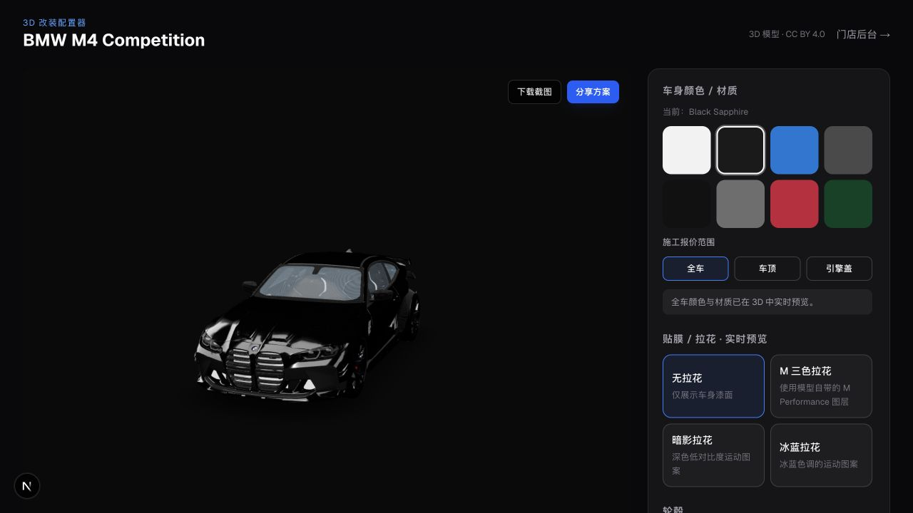

# Car Mod Studio — 3D 汽车改装平台

一个面向汽车改装门店的全栈 SaaS MVP：客户可以在浏览器中实时预览车漆、贴膜、拉花、轮毂和卡钳方案，自动生成报价并预约到店；门店可在后台统一处理预约。



## 项目亮点

- **实时 3D 改装预览**：React Three Fiber 驱动的 BMW M4 交互模型
- **完整客户流程**：配置方案 → 自动报价 → 分享/截图 → 预约到店
- **门店管理后台**：查看预约、订单金额与客户方案，支持确认和取消
- **可信服务端定价**：服务端根据 Catalog 重建配置并计算报价，避免前端篡改价格
- **网页模型优化**：GLB 从 22.74 MB 压缩到 3.89 MB，并预加载关键资源

## 功能

- **C 端**：3D 配置器（换色/拉花、轮毂色、卡钳色）→ 分享/截图 → 报价明细 → 预约
- **B 端**：门店后台查看预约、确认订单
- **数据**：SQLite + Prisma（MVP 本地开发）
- **安全**：预约配置由服务端 Catalog 重建并定价，Quote/Appointment 事务写入

## 快速开始

```bash
git clone https://github.com/lukaizj/car-mod-saas.git
cd car-mod-saas
npm install
npm run db:setup    # 初始化数据库 + 种子门店
npm run dev         # http://localhost:3000
```

> `next dev` 首次访问会包含 Turbopack 按需编译时间。评估真实加载速度请使用 `npm run build && npm run start`。

## 页面

| 路径 | 说明 |
|------|------|
| `/` | 落地页 |
| `/configure` | 3D 配置器 + 实时报价 |
| `/quote` | 报价明细 + 预约表单 |
| `/dashboard` | 门店后台 |

## 3D 模型

BMW M4 原始 GLB 位于 `public/models/bmw-m4.glb`，运行时使用面向网页裁剪的 `public/models/bmw-m4.web.glb`。运行模型由 22.74 MB 降至 3.89 MB（约 82.9%），并通过页面资源提示提前下载；HDR 环境光已改成本地程序化灯光，不再等待第三方资源。完整作者、来源、许可和哈希见 [`public/models/ATTRIBUTION.md`](public/models/ATTRIBUTION.md)。

重新生成优化模型（脚本不会覆盖原文件或已有输出）：

```bash
./scripts/optimize-model.sh public/models/bmw-m4.glb /tmp/bmw-m4.optimized.glb
./scripts/build-web-model.sh public/models/bmw-m4.glb /tmp/bmw-m4.web.glb
```

> MVP 阶段：车身换色/材质、拉花、轮毂颜色、卡钳颜色已实时预览；车顶/引擎盖局部施工及轮毂款式、尾翼、包围为**报价 + 状态记录**，部件 swap 需后续在 Blender 中模块化导出。

## 技术栈

- Next.js 16 · React 19 · TypeScript · Tailwind CSS 4
- React Three Fiber · drei · Three.js
- Prisma · SQLite · Zustand

## 项目结构

```text
src/app/                  Next.js 页面与 API Routes
src/components/           3D 配置器与业务组件
src/lib/                  Catalog、报价和数据库逻辑
src/store/                Zustand 配置状态
prisma/                   数据模型、迁移与种子数据
public/models/            原始与网页优化后的 GLB 模型
scripts/                  可复现的模型压缩脚本
```

## 下一步

1. Blender 按 `body / roof / hood / wheels / spoiler / bodykit` 拆分并统一原点、轴向和命名
2. 为轮毂、尾翼、包围制作独立 GLB，接入真实部件 swap
3. 多租户（tenant_id）+ 门店鉴权 + 独立价表（上线前必做）
4. 微信通知 / PDF 报价单

## 作者

由 [@lukaizj](https://github.com/lukaizj) 开发和维护。

## 模型许可

演示车辆模型采用 CC BY 4.0 许可，完整作者、来源与哈希信息请查看 [`public/models/ATTRIBUTION.md`](public/models/ATTRIBUTION.md)。
